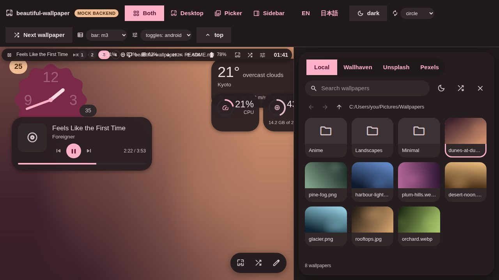

# beautiful-wallpaper

Windows 10 / 11 向けの Material 3 デスクトップシェルです。
[end4-pC](https://github.com/pctrade/end4-pC) と
[illogical-impulse](https://github.com/end-4/dots-hyprland) の体験を、Windows
自身の API の上に作り直したものです。

壁紙が配色を決め、デスクトップウィジェットも壁紙セレクタも、これから作るパネル
群も、すべてそこから導かれます。

<!-- スクリーンショットは実際のサーフェスから生成しています（`pnpm screenshots`）。 -->



## なぜ「移植」ではなく「作り直し」なのか

end4-pC は [Quickshell](https://quickshell.org) の設定です。65,000 行の QML が
Hyprland の IPC ソケットと会話し、すべてのパネルを `wlr-layer-shell` で配置して
います。Windows にはそのランタイムもプロトコルもコンポジタも存在しません。
したがって設計は引き継ぎ、コードは引き継ぎません。

本家が Wayland プロトコルでやっていることを、こちらは Win32 でやります。

| end4-pC                                   | 本プロジェクト                                           |
| ----------------------------------------- | -------------------------------------------------------- |
| `WlrLayer.Bottom` の壁紙レイヤー          | `WorkerW` 配下に付け替えたウィンドウ                     |
| バーの `exclusiveZone`                    | `SHAppBarMessage`                                        |
| `WlrLayer.Overlay` のパネル               | 最前面の `WS_EX_TOOLWINDOW｜WS_EX_NOACTIVATE` ウィンドウ |
| `mask: Region` の入力透過                 | `WS_EX_TRANSPARENT`                                      |
| `switchwall.sh` → matugen → `colors.json` | `material-colors` クレートをプロセス内で                 |
| MPRIS                                     | Windows のメディアセッション (SMTC)                      |
| UPower / PipeWire / `/proc`               | `GetSystemPowerStatus` / WASAPI / `sysinfo`              |
| Hyprland のワークスペース                 | GlazeWM / komorebi（動いていれば）                       |
| `IpcHandler` のターゲット                 | 名前付きパイプ（ターゲット名は同一）                     |

本家が選んだ接合面は、そのまま Windows でも通用します。`colors.json` の形、
`GlobalStates` のフラグ、IPC の語彙はすべて維持しているので、覚えた操作や
書いたスクリプトはこちらでも意味を持ちます。

## 現時点で動くもの

- **壁紙からの Material 3 配色生成。** 壁紙の代表色を量子化・スコアリングし、
  画像に合うスキームバリアントを選び、全ロール（本家独自の `success` 4 色と
  ターミナル 16 色を含む）を導出します。Windows のアクセントカラーと Windows
  Terminal への反映も任意で行えます。
- **背景サーフェス**: GPU トランジション付きの壁紙表示と、デスクトップ
  ウィジェット（時計・メディア・天気・CPU/RAM/ディスク・カレンダー・ユーザー
  カード）。ドラッグしてグリッドにスナップできます。
- **壁紙セレクタ**: 履歴とサムネイル付きのローカルフォルダ閲覧に加え、
  Wallhaven / Unsplash / Pexels。
- **設定は JSON 一枚**、双方向監視。任意のエディタで編集すればシェルが追従します。
- **CLI** — `bw wallpapers apply <path>`、`bw config set bar.bottom true` など。
  ホットキーやスクリプトから使えます。
- **14 言語ぶんの i18n 基盤**（英語と日本語を収録）。

サイドバー、通知、ランチャー、設定 UI は次以降のフェーズです。バーに未実装で
残っている部分と併せて [docs/roadmap.md](docs/roadmap.md) を参照してください。

## インストール

最新の CI 実行からインストーラーを取得するか、自分でビルドします。

```powershell
pnpm install
pnpm --filter @bw/shell app:build
```

成果物は `target/release/bundle/` に出ます。Windows 10 と 11 の両方に対応し、
[WebView2](https://developer.microsoft.com/microsoft-edge/webview2/) が必要です
（Windows 11 には標準で入っています）。

## 開発

UI は WebView なので、大部分は Windows なしで作って確認できます。`pnpm dev` は
モックバックエンドに対してすべてのサーフェスを表示します。

```bash
pnpm install
pnpm dev            # 全サーフェスを並べて表示（システム情報はダミー）
pnpm screenshots    # 各サーフェスを screenshots/ に描画
```

実機（Windows）で動かす場合:

```powershell
pnpm --filter @bw/shell app:dev
```

チェック:

```bash
pnpm lint && pnpm typecheck && pnpm test   # フロントエンド
cargo test -p bw-core                      # 移植可能なコア
cargo clippy --target x86_64-pc-windows-msvc --all-targets
```

最後のコマンドが重要です。Windows 実機もクロスコンパイラもなしに、すべての
Win32 / WinRT 呼び出しを型検査できます。Windows ターゲットの `cargo check` は
Linux でも macOS でも通り、Windows が要るのはリンクだけです。

同梱のアイコンフォントは、シェルが描画するアイコンだけに絞った Material Symbols の
サブセットで、対象は `apps/shell/scripts/icons.json` に列挙してあります。リストに
無い名前は字形ではなく**その単語がそのまま描画される**ため、UI にアイコンを増やす
ときはこのファイルに追記して `pnpm gen:icons` を実行してください（`fonttools` と
`brotli` が必要です）。

Rust のツールチェーンは `rust-toolchain.toml` で固定してあり、rustup が CI と
同じコンパイラを clippy・rustfmt・Windows ターゲットごと入れます。これは
`-D warnings` にとって重要です。バージョンが違うと、CI が強制するリントが手元に
存在せず、その差が CI の赤としてしか現れません。

## 構成

```
crates/bw-core/          設定スキーマ、Material 3 パイプライン、壁紙一覧
                         — Tauri も Win32 も使わず、どこでもテストできる
apps/shell/src-tauri/    Windows 側: レイヤリング、プロバイダ、IPC、コマンド
apps/shell/src/          各サーフェス (React)、ウィジェットキット、モック
packages/core/           Rust↔TS の契約。Rust の型から生成
packages/tokens/         派生トークン層 — Appearance.qml の TypeScript 版
```

`crates/bw-core` を変更したら `pnpm gen:types` を実行してください。TypeScript の
型とデフォルト設定は Rust のスキーマから生成しており、古いままだと CI が落ちます。

## ライセンス

派生元に合わせて GPL-3.0-or-later です。第三者素材と、本家から何を取り何を
取らなかったかは [NOTICE](NOTICE) に記載しています。
